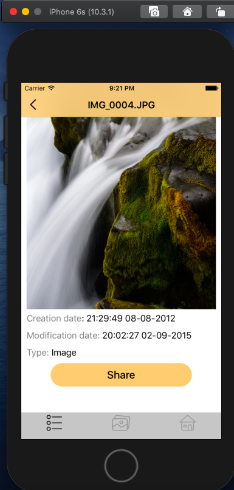
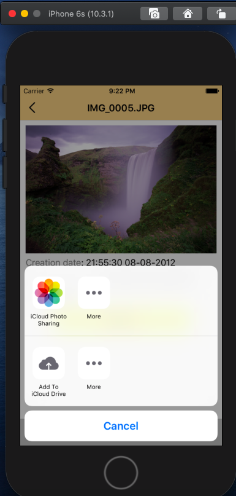

# Project Name: rs.ios-stage2-task6

## Description:

Разработка адаптивного приложения галереи под iPhone/iPad.  
Научиться работать с разными UI элементами и системными библиотеками.

## Project requirements

● поддерживать iOS версии от 10.0 и выше  
● использовать ARC  
● использовать xib и autolayout. Storyboard использовать нельзя  
● поддерживать все размеры устройств, а также все возможные ориентации  
● для iPad отображение должно быть таким же, как для iPhone. Не нужно использовать SplitView  

### Installation:

1. Скачать Git-репозиторий
2. Установить на устройство под управление iOS 10.0+ с помощью xCode

## Work example:

**Screen 1:**

**Screen 2:**

**Screen 3:**

**Screen 4:**

**Screen 5:**

## Additional information

Technical Task - https://drive.google.com/file/d/1-6KO_XOh460RE1IkTFxZIw_VU-_ICixG/view  
Task Assets - https://drive.google.com/drive/folders/1rkS9AxNP5cr6-5vgYfA1WJ6RmMt5PAEc

